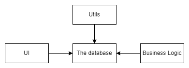
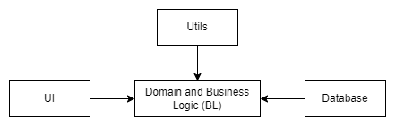

# Solid and meta principles overview <!-- omit in toc -->

## Contents <!-- omit in toc -->

- [1. Intro](#1-intro)
  - [1.1. Building software](#11-building-software)
  - [1.2. Design smells](#12-design-smells)
  - [1.3. Design principles - SOLID](#13-design-principles---solid)
  - [1.4. Dependency Management](#14-dependency-management)
- [2. What is SOLID?](#2-what-is-solid)
  - [2.1. How SOLID improve OO-programming skills](#21-how-solid-improve-oo-programming-skills)
  - [2.2. Why we need SOLID?](#22-why-we-need-solid)
- [3. Principles](#3-principles)
  - [3.1. SRP - Single Responsibility Principle](#31-srp---single-responsibility-principle)
    - [3.1.1. Calculating responsibilities](#311-calculating-responsibilities)
    - [3.1.2. Common SRP Violation](#312-common-srp-violation)
    - [3.1.3. Design pattern Façade](#313-design-pattern-façade)
    - [3.1.4. Others related patterns](#314-others-related-patterns)
    - [3.1.5. Summary](#315-summary)
  - [3.2. O - Open/closed principle](#32-o---openclosed-principle)
    - [3.2.1. Why OCP?](#321-why-ocp)
    - [3.2.2. Single choice principle:](#322-single-choice-principle)
    - [3.2.3. Development methodologies](#323-development-methodologies)
    - [3.2.4. Others related patterns](#324-others-related-patterns)
    - [3.2.5. Interfaces](#325-interfaces)
    - [3.2.6. Abstract Classes](#326-abstract-classes)
    - [3.2.7. Interfaces VS Abstract Classes](#327-interfaces-vs-abstract-classes)
    - [3.2.8. Common Smells](#328-common-smells)
    - [3.2.9. Adhering to OCP](#329-adhering-to-ocp)
    - [3.2.10. Summary](#3210-summary)
  - [3.3. L - Liskov Substitution Principle](#33-l---liskov-substitution-principle)
    - [3.3.1. Ways of breaking substitutability](#331-ways-of-breaking-substitutability)
    - [3.3.2. Contracts](#332-contracts)
      - [3.3.2.1. What is contract?](#3321-what-is-contract)
      - [3.3.2.2. What constitutes a method's contract?](#3322-what-constitutes-a-methods-contract)
    - [3.3.3. Code contracts in C#](#333-code-contracts-in-c)
    - [3.3.4. The problem of representatives](#334-the-problem-of-representatives)
    - [3.3.5. Common smells](#335-common-smells)
    - [3.3.6. Tips](#336-tips)
    - [3.3.7. Summary](#337-summary)
  - [3.4. I - Interface Segregation Principle](#34-i---interface-segregation-principle)
    - [3.4.1. What is Interface?](#341-what-is-interface)
    - [3.4.2. Historical background](#342-historical-background)
    - [3.4.3. Common smells](#343-common-smells)
    - [3.4.4. Fixes](#344-fixes)
    - [3.4.5. Related patterns](#345-related-patterns)
    - [3.4.6. Adapter pattern](#346-adapter-pattern)
    - [3.4.7. Tips](#347-tips)
    - [3.4.8. Summary](#348-summary)
  - [3.5. D - Dependency Inversion Principle](#35-d---dependency-inversion-principle)
    - [3.5.1. Types of dependencies](#351-types-of-dependencies)
    - [3.5.2. Policy depends on Details](#352-policy-depends-on-details)
    - [3.5.3. Policy doesn't depend on Details](#353-policy-doesnt-depend-on-details)
    - [3.5.4. Volatile and stable dependencies](#354-volatile-and-stable-dependencies)
      - [3.5.4.1. Volatile dependencies](#3541-volatile-dependencies)
    - [3.5.5. Definitions of IoC and DI](#355-definitions-of-ioc-and-di)
      - [3.5.5.1. Inversion of Control (IoC)](#3551-inversion-of-control-ioc)
      - [3.5.5.2. DIP](#3552-dip)
    - [3.5.6. IoC and DI](#356-ioc-and-di)
    - [3.5.7. DI Techniques](#357-di-techniques)
      - [3.5.7.1. Constructor injection](#3571-constructor-injection)
        - [3.5.7.1.1. Possible pitfall](#35711-possible-pitfall)
      - [3.5.7.2. Property Injection](#3572-property-injection)
        - [3.5.7.2.1. Possible pitfall](#35721-possible-pitfall)
      - [3.5.7.3. Method Injection](#3573-method-injection)
        - [3.5.7.3.1. Pitfalls](#35731-pitfalls)
    - [3.5.8. Architectural Implications](#358-architectural-implications)
      - [3.5.8.1. Application Boundaries](#3581-application-boundaries)
      - [3.5.8.2. Data-Centric Model](#3582-data-centric-model)
      - [3.5.8.3. Domain-Centric Model](#3583-domain-centric-model)
      - [3.5.8.4. Enlarged Domain-Centric Model](#3584-enlarged-domain-centric-model)
      - [3.5.8.5. Pure DI and IoC-Containers](#3585-pure-di-and-ioc-containers)
        - [3.5.8.5.1. IoC-Containers](#35851-ioc-containers)
      - [3.5.8.6. Common Smells](#3586-common-smells)
    - [3.5.9. Others related patterns](#359-others-related-patterns)
    - [3.5.10. Summary](#3510-summary)
- [4. Meta principles](#4-meta-principles)
  - [4.1. DRY - Don't Repeat Yourself](#41-dry---dont-repeat-yourself)
    - [4.1.1. Common violations of DRY](#411-common-violations-of-dry)
  - [4.2. KISS - Keep it Simple, Stupid](#42-kiss---keep-it-simple-stupid)
    - [4.2.1. What is Simplicity?](#421-what-is-simplicity)
    - [4.2.2. Accidental \& Essential Complexity](#422-accidental--essential-complexity)
    - [4.2.3. Achieving Simplicity](#423-achieving-simplicity)
    - [4.2.4. Simplicity](#424-simplicity)
  - [4.3. YAGNI - You Ain't Gonna Need It](#43-yagni---you-aint-gonna-need-it)
    - [4.3.1. Worse is better](#431-worse-is-better)
    - [4.3.2. YAGNI Violation](#432-yagni-violation)
      - [4.3.2.1. Questions](#4321-questions)
      - [4.3.2.2. Challenges](#4322-challenges)
  - [4.4. SoC - Separation of Concerns](#44-soc---separation-of-concerns)
  - [4.5. CQS - Command-Query Separation](#45-cqs---command-query-separation)
  - [4.6. LoD - Law of Demeter](#46-lod---law-of-demeter)
    - [4.6.1. Scenario Customer vs Paperboy](#461-scenario-customer-vs-paperboy)
  - [4.7. PoLA - Principle of Least Astonishment](#47-pola---principle-of-least-astonishment)
  - [4.8. Information Hiding and Encapsulation](#48-information-hiding-and-encapsulation)
  - [4.9. General Principles of Building APIs](#49-general-principles-of-building-apis)
    - [4.9.1. API Intro](#491-api-intro)
    - [4.9.2. API Characteristics](#492-api-characteristics)
      - [4.9.2.1. Simplicity](#4921-simplicity)
      - [4.9.2.2. Expressiveness and Compromises](#4922-expressiveness-and-compromises)
      - [4.9.2.3. Extensibility](#4923-extensibility)
      - [4.9.2.4. Consistency](#4924-consistency)
      - [4.9.2.5. Public API vs Private API](#4925-public-api-vs-private-api)
      - [4.9.2.6. API Development Principles](#4926-api-development-principles)
  - [4.10. Summary](#410-summary)

# 1. Intro

## 1.1. Building software

- Big design upfront is very expensive in software development.
- No guarantee that we take into account all the possible requirements.
- Requirements tend to change very quickly .
- Keep the design as clean as you can.

## 1.2. Design smells

- Rigidity:
  - Software is rigid if the cost of making a single change is very high
    - **Reason - tight coupling between modules.**
- Fragility:
  - Software is fragile if small changes in one module cause bugs appearance in other.
    - **Reason – tight coupling between components.**
- Immobility:
  - Software is immobile when it's components can't be reused in other systems.
    - **Reason - tight coupling between components.**
- Viscosity:
  - The software is viscose when adding a single feature evokes dealing with tons of aspects.
    - **Reason - tight coupling between components.**
- Needless Complexity:
  - Software is needlessly complex if developers are trying to forecast the future, introducing excessive points of extension.
  - Concentrate on the current requirements, constructing the supple architecture which can bend to meet new requirements.

## 1.3. Design principles - SOLID

- SOLID software principles, is the set of principles put forward by **Robert C. Martin**, which ensures that the software developed is flexible, reusable, sustainable and understandable, prevents code repetition.
- Frequently references in Design Pattern literature.
- So the main purpose of these principles, in order to easily adapted to requirements in the future and easier to add new features without the need to change anything in your code and also minimal change in code despite the new requirements and minimize the loss of time caused by the problems, such as the continuous correction on the code or even re-writing to code.
- Not bound to any technology.
- SOLID is not a goal.
- "SOLIDness" is not measurable.

## 1.4. Dependency Management

- OO-languages can harness the power of dynamic dispatch.
- Proper dependency management - key to a good architecture.

# 2. What is SOLID?

- SOLID stands for SRP, OCP, LSP, and DIP:
  - Single Responsibility Principle.
  - Open/Closed Principle.
  - Liskov Substitution Principle.
  - Interface Segregation Principle.
  - Dependency Inversion Principle.

## 2.1. How SOLID improve OO-programming skills

- Meta principles on which all the other development principles are based.
- Symptoms of code defects.
- Foundations of SOLID principles.
- Detect the violations of SOLID principles and how to fix the problems.
- How meta and SOLID principles are related to each other and how to find the balance between them.

## 2.2. Why we need SOLID?

- Poor design is a regular case.
- Powerful programming language doesn't guarantee good design.
- Designing skills are prerequisite for serious programming.

# 3. Principles

## 3.1. SRP - Single Responsibility Principle

- Every object should have a single responsibility, and that responsibility should be entirely encapsulated by the class.
- _There should never be more than one reason for a class to change._ Robert C. Martin aka Uncle Bob

### 3.1.1. Calculating responsibilities

- Axes of changing requirements.
- API users are the source of changes.
- More responsibilities a class has, the more likely it's going to be changed.
- Classes with too many responsibilities are hard to understand!
- When SRP is violated, responsibilities start to collate with each other. They become coupled.
- Gather all the same responsibilities together and separate from each other those which are different.
- A set of functions or an interface is considered cohesive when each function is closely related to another.
- Coupling indicates how dependent modules are on the inner working of each other.

### 3.1.2. Common SRP Violation

- Mixing logic and infrastructure.
- A class or a module serves different layers.

### 3.1.3. Design pattern Façade

- Applying the SRP leads to appearance of many small classes.
  - It is hard to understand the API of too many small classes.
    - "Façade" design pattern may come to the rescue.
- Façade:
  - The Façade's responsibility is to bring the functionality required by a client together.
  - Reasons for applying Façade:
    - Provide for a client a simple API for interaction with a set of complex objects.
    - Provide for a client a cleaner API for interaction with poorly designed API.

### 3.1.4. Others related patterns

- Decorator
  - Decorator allows the behavior to be added to an individual object, either statically or dynamically, without affecting the behavior of other objects from the same class.
- Composite
  - Composite pattern allows to compose objects into tree structures to represent part-whole hierarchies, letting clients treat individual objects and compositions of objects uniformly.

### 3.1.5. Summary

- Applying SRP we want to separate different concerns.
- A class should do one thing, and do it well!
- Apply SRP at different levels:
  - function
  - object
  - module
- Classes with many responsibilities are hard to understand.
- When SRP is violated, responsibilities start to collate with each other.
- Don't abuse the SRP.
- Apply Façade pattern to simplify the API.
- Modules that change frequently should be isolated from the other parts of the system.

## 3.2. O - Open/closed principle

- Software entities should be open for extension, but closed for modification.
- We should be able to introduce a change by adding new code, not by changing the existing.
- **Polymorphism is the Answer.**

### 3.2.1. Why OCP?

- There is a high chance of introducing bugs during the modification process.
- It's hard to modify the behavior of an API which is already in use by many clients.
- When customers ask for a new feature they think that features will be added, they don't think that developers will modify anything.
- We must modify the existing code if it contains a bug.
- The Protected Variation pattern means the following: Identify points of predicted variation and create a stable interface around them.

### 3.2.2. Single choice principle:

```
    public class BankTerminalFactory
    {
        public static IBankTerminal CreateBankTerminal(BankTerminalModel model)
        {
            switch (model)
            {
                case BankTerminalModel.Brp:
                    return new BrpTerminal();
                case BankTerminalModel.Dcp:
                    return new DcpTerminal();
                default:
                    throw new ArgumentException("Unknown model");
            }
        }
    }
```

- We can't achieve a super-supple design which allows to introduce any possible features.

### 3.2.3. Development methodologies

- Waterfall
  - Try to foresee all the possible details.
- Agile
  - Iterative development process with high involvement of a customer.

### 3.2.4. Others related patterns

- Template Method
  - It defines the skeleton of an algorithm in an operation, deferring some steps to subclasses.
  - Template Method lets subclasses redefine certain steps of an algorithm without changing the algorithm's structure.
- Strategy
  - Strategy enables an algorithm's behavior to be selected at runtime.
    - The strategy pattern:
      - Defines a family of algorithms.
      - Encapsulates each algorithm.
      - Makes the algorithms interchangeable within that family.
- **Specification pattern**

### 3.2.5. Interfaces

- Interfaces can't be easily changed without breaking existing clients.
- Interfaces are easily extendable by clients.
- In other words...
  - An interface is suppler from the client's perspective: any class can implement as many interfaces as it wants to.
  - An interface is more rigid from the developer's perspective: it can't be easily changed and it does not support any kind of reusability.

### 3.2.6. Abstract Classes

- Supports reusability.
- Supports encapsulation.
- Can be extended easily without breaking existing clients.
- In other words...
  - An abstract class is supple from the developer's perspective.
  - An abstract class is rigid from the client's perspective.

### 3.2.7. Interfaces VS Abstract Classes

- Use abstract classes for building internal APIs.
- Use interfaces for providing external points of extension.
- In other words...
  - An abstract class is supple from the developer's perspective.
  - An abstract class is rigid from the client's perspective.

### 3.2.8. Common Smells

- Many conditional branches with if\else or switch\case statements.

### 3.2.9. Adhering to OCP

- Parameterization with delegates. "Chain of Responsibility" design pattern.
- Classic Inheritance or "Visitor" design pattern.
- Composition VS Inheritance. "Strategy" design pattern.

### 3.2.10. Summary

- Design should be open for extensions and closed for modification.
- Isolate a responsibility for creating objects in a single module (Single Choice Principle).
- Related patterns: "Template Method" and "Strategy".
- Interface is suppler from the client's perspective.
- Abstract class is suppler from the developer's perspective.
- To overcome the problem of predicting the future, we rely on "agile design".

## 3.3. L - Liskov Substitution Principle

- If **S** is a subtype of **T**, then objects of type **T** may be replaced with objects of type **S**, without breaking the program.
- The Liskov Substitution Principle states that Subtypes must be substitutable for their base types.

### 3.3.1. Ways of breaking substitutability

- Violating a Contract.
- Violating Covariance\Contravariance.

### 3.3.2. Contracts

- Programming to Contracts was elaborated by Bertrand Meyer [DbC](https://en.wikipedia.org/wiki/Design_by_contract).
  - "Object-Oriented Software Construction" by Meyer is recommended.
  - Eiffel [Eiffel](<https://en.wikipedia.org/wiki/Eiffel_(programming_language)>).

#### 3.3.2.1. What is contract?

- Contracts have some semantic payload.
- Interfaces have no any semantic payload.
- **Interfaces are not Contracts.**

#### 3.3.2.2. What constitutes a method's contract?

- Acceptable and unacceptable input values or types, and their meanings.
- Return values or types, and their meanings.
- Error and exception condition values or types that can occur, and their meanings.
- Side effects.
- Preconditions.
- Postconditions.
- Invariants.

### 3.3.3. Code contracts in C#

- You can write contracts in C# with a library called "Code Contracts". Harness the power of static code verification on correctness [CodeContracts](https://docs.microsoft.com/en-us/dotnet/framework/debug-trace-profile/code-contracts).
- "Code Contracts" library is not very popular.

### 3.3.4. The problem of representatives

- OOP can't directly map the relationships between objects in the real world into the same model of relationships between them in code.
- Child classes implement IS-A relationship with base classes - naive statement of OOP.
- Inheritors can require less and guarantee more but not vice-versa.
- Refused Bequest.
- Programming code just represents the concepts of square and rectangle.

### 3.3.5. Common smells

- Method throws NotSupportedException.
- Empty or degenerative implementation.
- Downcasts.

### 3.3.6. Tips

- Tell, Don't Ask principle.
- LSP if often the result of OCP or ISP violations.
- If two classes share some logic and they are not substitutable.
  - Create new base class.
  - Inherit those two classes from a base class.
  - Ensure that they are substitutable with the new base class

### 3.3.7. Summary

- You should be able to substitute a base type for a subtype.

## 3.4. I - Interface Segregation Principle

- ISP states that Clients should not be forced to depend on methods they do not use.
  - Prefer small, cohesive interfaces.
- ISP violations result in classes that depend on things they do not need, increasing coupling and reducing flexibility and maintainability.

### 3.4.1. What is Interface?

- `Interface` is a reserved keywork in C# which allows to declare a non-implementable type consisting of member signatures.
- Defines an API.
- Public API of a class is an interface.

### 3.4.2. Historical background

- First public formulation belong to Uncle Bob.
- Uncle Bob applied ISP working for xerox.
- That was a printing system.

### 3.4.3. Common smells

- LSP violation smell often indicates a violation of ISP.

### 3.4.4. Fixes

- Client's code references a class but uses only a small portion of its API:
  - Fat interface => Segregate it
  - Fat interface which is not under your control => Facade pattern

### 3.4.5. Related patterns

- Adapter pattern.
- Facade.

### 3.4.6. Adapter pattern

- Convert the interface of a class into another interface clients expect.
- Adapter lets classes work together that couldn't otherwise because of incompatible interfaces.

### 3.4.7. Tips

- General algorithm of "fixing" fat interfaces:
  - Create narrower interface.
  - Fat interface inherits from that narrow interface.
  - Client uses narrow interface.
- Don't abuse ISP by creating tons of small interfaces.
- Keep an interface within the client's assembly if possible.

### 3.4.8. Summary

- Don't put too much into an interface; split into separete interfaces.
- YAGNI - You Ain't Gonna Need It.

## 3.5. D - Dependency Inversion Principle

- DIP is about decoupling!
- Coupling indicates how dependent modules are on the inner workings of each other.
- DIP is applicable both at the source code and binary level.
- Low coupling:
  - Is often a sign of a well-structured computer system and a good design, and when combined with high cohesion, supports the general goals of high readability and maintainability.
- Definition:
  - **High-level** modules should not depend on **low-level** modules.
    - Both should depend on **abstractions**.
  - Abstractions should not depend on details.
    - Details should depend on abstactions.

### 3.5.1. Types of dependencies

- Framework.
- 3rd party libs.
- External Systems like File System, Database, any system resource.
- Dependency on a custom type built on top of the .NET framework.

### 3.5.2. Policy depends on Details

- High-level objects of the domain layer directly depend on low-level objects of the infrastructural layer.
- It's hard to replace coupled dependencies.
- We can solve any problem by introducing an extra level of indirection.


### 3.5.3. Policy doesn't depend on Details

- IPersonRepository is a seam which inverts the dependencies.


### 3.5.4. Volatile and stable dependencies

- Dependencies can be divided into two camps:
  - Volatile.
  - Stable.

#### 3.5.4.1. Volatile dependencies

- A dependency is volatile if any of the following criteria is true:
  - Dependency itself depends on the environment (web servers, db).
  - Dependency doesn't yet exist and is still under development.
  - Dependency which is not installed on all machines of developers.
  - Dependency has a nondeterministic behavior (randomizers inside).
- **If none of these true, a dependency is stable**.
- Volatile dependencies are those which we want to abstract away by introducing levels of indirection.
- Unstable (Volatile), have to be isolated.

### 3.5.5. Definitions of IoC and DI

#### 3.5.5.1. Inversion of Control (IoC)

- IoC reflects the model of relationships between a caller and a callee.
- Classic flow of control implies that a client has a full control over the environment and sequence of calls to library methods.
- IoC implies that a callee takes control over some calls between caller and callee. (callbacks is the simplest form).
- Frameworks rule the client's code.

#### 3.5.5.2. DIP

- DIP is a detailed version of IoC.
- Concretizes that "High-level modules should not depend on low level modules".
- Dependency injection (DI) is a set of software design principles and patterns that enable us to develop loosely coupled code.

### 3.5.6. IoC and DI

- IoC can exist without DI.
- The main way to perform the inversion of control is to apply DI techniques.

### 3.5.7. DI Techniques

#### 3.5.7.1. Constructor injection

- Protects the invariants.

##### 3.5.7.1.1. Possible pitfall

- Tends to accumulate many dependencies.
  - Smell of SRP violation, consider extracting a class.
- Several dependencies tend to be passed in together:

  ```
    interface IDependency1 { }
    interface IDependency2 { }
    interface IDependency3 { }
    interface IDependency4 { }

    class ViewModel
    {
      public ViewModel( IDependency1 d1,
                        IDependency2 d2,
                        IDependency3 d3,
                        IDependency4 d4)
      {

      }
    }
  ```

  ```
    class Infrastructure : IInfrastructure
    {
      public Infrastructure(IDependency1 d1,
                            IDependency2 d2,
                            IDependency3 d3,
                            IDependency4 d4)
      {

      }
    }

    class ViewModel
    {
      public ViewModel(IInfrastructure infrastructure)
      {

      }
    }
  ```

- Non-obligatory dependencies:

  ```
    public class Customer {
      private ILogger _logger = new Logger();

      public Customer() {}

      public Customer(ILogger logger) {
          _logger = logger;
      }
    }
  ```

- 3rd party framework imposes a public default constructor:

  ```
    public class Customer {
      private ICustomerRepo _repo;

      //HAVE TO EXPOSE
      public Customer() {}

      public Customer(ICustomerRepo repo) {
        _repo = repo;
      }
    }
  ```

- A certain dependency is used only in a single method.
  - Use method injection instead.

#### 3.5.7.2. Property Injection

##### 3.5.7.2.1. Possible pitfall

- Breaks encapsulation:

```
  public class Customer
  {
    public Customer()
    {
    }

    public ILogger Logger { get; set; } = new Logger();
  }
```

#### 3.5.7.3. Method Injection

- Apply if only one method uses a dependency or that dependency changes from one call to another.

```
  public interface ICurrencyRateProvider {
    int GetCurrencyRate(string currency);
  }

  public class PaymentService {
    public static Money CalculatePayment(ICurrencyRateProvider currencyRate) {
      return new Money();
    }
  }
```

##### 3.5.7.3.1. Pitfalls

- SRP Violation.
- IoC-Containers don't inject dependencies into methods.

### 3.5.8. Architectural Implications

#### 3.5.8.1. Application Boundaries

- Plugins can be deployed and developed independently.
- Divide the system by boundaries and invert the dependencies that cross those boundaries.
- Plugins define the boundaries of a system.

#### 3.5.8.2. Data-Centric Model

- Data and Schema rule the world.
- Logic in SQL Stored Procedures.
- SQL is suited for tuples processing, not for modeling objects relationships.



#### 3.5.8.3. Domain-Centric Model

- Domain is the Core.
- Domain is Stable.



#### 3.5.8.4. Enlarged Domain-Centric Model

- Ports and Adapters architecture.
- **Ports are seams** we introduce by extracting interfaces and **adapters are plugins** which come from the boundary of a system.
- Strive to keep the graph as flatter as you can.
- Who is responsible for keeping the control over the dependencies instantiation and their lifetime?
  - Answer: "Main as the infrastructural point."
  - Conforms to "Single Choice" principle.
  - Only Main knows about dependencies and their relationships.

#### 3.5.8.5. Pure DI and IoC-Containers

- Two ways of dealing with DI:
  - Manually create all the dependencies injecting them explicitly – "Pure DI".
  - Use an IoC-Container (also knows as DI-Containers).

##### 3.5.8.5.1. IoC-Containers

- IoC-Container is a framework which helps to apply DI.
  - Injects dependencies automatically.
  - Dependencies configuration.
  - Knows everything about dependencies.

#### 3.5.8.6. Common Smells

- A class explicitly creates one or more dependencies hiding them from a client.
- A class uses nondeterministic dependencies like DateTime or Random.
  - Extract a class which works with non-deterministic dependencies and cover it by integration tests.
  - Create an adapter.
- A class uses static dependencies, very often singletons.
- To remove the smell:
  - Extract a layer of indirection and make high-level policies independent of low-level details.
  - Adhere to the SRP.

### 3.5.9. Others related patterns

- Factory pattern.

### 3.5.10. Summary

- High-level modules should not depend upon low-level ones, use abstractions.

# 4. Meta principles

## 4.1. DRY - Don't Repeat Yourself

- A substantial number of bugs in software are caussed by repetitive code.
- Every piece of knowledge must have a single, unambiguous representation in the system.

### 4.1.1. Common violations of DRY

- Magic strings or any other magic values.
- Duplicate logic in multiple locations.
- Repeated `if-then` logic or multiple switch-cases scattered throughout the code base.

- Examples with magic values:

  - Bad:

  ```
  int reponseCode = GetDeviceResponse();
  if (responseCode == 188)
  {

  }
  ```

  - Good:

  ```
  const int NoConnection = 188;
  int reponseCode = GetDeviceResponse();
  if (responseCode == NoConnection)
  {

  }
  ```

  ***

  - Bad:

  ```
  public class MagicValues
  {
  	public void AcceptCard()
  	{
  		var d = new Device();
  		d.SendCommand(1);
  		d.SendCommand(2);
  		d.SendCommand(9);
  	}

  	public void DispenseCard()
  	{
  		var d = new Device();
  		d.SendCommand(1);
  		d.SendCommand(3);
  		d.SendCommand(9);
  	}
  }
  ```

  - Good:

  ```
  public class NoMagic
  {
  	private const int Initialize = 1;
  	private const int Terminate = 9;

  	public void AcceptCard()
  	{
  		var d = new Device();
  		d.SendCommand(Initialize);
  		d.SendCommand(2);
  		d.SendCommand(Terminate);
  	}

  	public void DispenseCard()
  	{
  		var d = new Device();
  		d.SendCommand(Initialize);
  		d.SendCommand(3);
  		d.SendCommand(Terminate);
  	}
  }
  ```

  - Good without duplicated code:

  ```
  public class NoDuplicateLogic {
  	private const int Initialize = 1;
  	private const int Terminate = 9;

  	public void AcceptCard() {
  		ExecuteCommand(2);
  	}

  	public void DispenseCard() {
  		ExecuteCommand(3);
  	}

  	private void ExecuteCommand(byte command) {
  		var d = new Device();
  		d.SendCommand(Initialize);
  		d.SendCommand(command);
  		d.SendCommand(Terminate);
  	}
  }
  ```

- Other case of violation

  ```
    public class Dispenser
    {
      public string ModelName { get; set; }
      public string Port { get; set; }

      public void Dispense()
      {
      }
    }

    public class Accepter
    {
      public string ModelName { get; set; }
      public string Port { get; set; }

      public void Accept()
      {
      }
    }
  ```

- Alternative to code above, with points of attention...

  ```
    public class Device
    {
      public string ModelName { get; set; }
      public string Port { get; set; }
    }

    public class Dispenser : Device
    {
      public void Dispense()
      {

      }
    }

    public class Accepter : Device
    {
      public void Accept()
      {
      }
    }
  ```

- Repeated if-then or switch-case

  ```
    public enum Shape
    {
      Circle,
      Rectangle,
      Square,
      Hexagon
    }

    public class Visualizer
    {
      public void Draw(Shape shape)
      {
        switch (shape)
        {
          case Shape.Circle:
          break;
          case Shape.Hexagon:
          break;
          case Shape.Rectangle:
          break;
          case Shape.Square:
          break;
        }
      }

      public decimal CalculateArea(Shape shape)
      {
        // Switch case.
      }
    }
  ```

- Removing repeated if-then or switch-case

  ```
    abstract class Shape
    {
      abstract void Draw();
      abstract decimal CalcArea();
    }

    public class Rectangle : Shape
    {
      public override void Draw()
      {

      }

      public override decimal CalcArea()
      {

      }
    }

    public class Circle : Shape
    {
      public override void Draw()
      {

      }

      public override decimal CalcArea()
      {

      }
    }
  ```

## 4.2. KISS - Keep it Simple, Stupid

- "Make everything as simple as possible, but not simpler" – _Albert Einstein_
- Simplicity is a key goal in design.
  - YAGNI is about removing unnecessary code.
  - KISS is about making the simplest implementation.
- KISS definition, "A simple solution is better than a complex one, even if the solution look stupid".

### 4.2.1. What is Simplicity?

- Simplicity is the state or equality of being simple.
- Something which is easy to understand or explain can be considered simple, in contrast to something complicated.
- The feeling of simplicity is relative.

### 4.2.2. Accidental & Essential Complexity

- Complexity imposed by the domain itself is called the "essential complexity".
- "Accidental complexity" is the complexity of our solutions which are intended to solve the problems of the domain.

### 4.2.3. Achieving Simplicity

- Main technique is **Decomposition**.
  - Decomposition underlies all the SOLID principles.
- SOLID are aimed at achieving simplest solutions;
  - Abusing SOLID leads to unnecessary complexity! => Unity and Struggle of Opposites law.
- Prefer composition over inheritance where possible.
- Stick with if-else and switch-case statements until you see that you need to introduce **polymorphism**.
- Avoid preemptive optimizations:
  - In 90% of cases slower solutions work enough fast..
  - The exceptions: app main aspect of which is the performance.
- Smaller classes and smaller methods are better:
  - The best method is a one-liner "Extract till you drop" technique.
- Don't rush to extract utility classes for private methods which are used from a single place within a class, leave it as it is until the other parts of code will require that method as well.
- Don't write parameterized general methods, prefer methods which solve a specific problem.
- Divide and conquer.
- Strive to avoid comments.
- Write prototypes and don't be afraid to throw them away.
- Keep the number of entities which solve a problem roughly from 5 to 7.
- **Constantly work on simplifying your code base**.
- Keep the amount of optimized code closer to 5-10%.

### 4.2.4. Simplicity

- Two values of software:
  - Correctness.
  - Good design.

## 4.3. YAGNI - You Ain't Gonna Need It

- YAGNI is all about avoiding overengineering.
- There is no a well-defined criterion to measure the "YAGNI-ness".
- "Always implement things when you actually need them, never when you just foresee that you need them". _Ron Jeffries_

### 4.3.1. Worse is better

- A model of software design and implementation which has the following characteristics:
  - Simplicity.
  - Correctness.
  - Consistency.
  - Completeness.
- "If you do something for a future need that doesn't actually increase the complexity of the software, then there's no reason to invoke YAGNI." _Martin Fowler_
- Don't follow any principles blindly.
- YAGNI depends on supporting practices, follow other practices such as Continuous Integration, Refactoring, Unit Testing as well.

### 4.3.2. YAGNI Violation

- A team is working on a payment system which interoperates with many devices:
  - Working on a current version, you need to implement a driver for interoperating with the model "Z" of a bill dispenser.
  - At the same time, a project manager expects that in four month they will need to support the "Y" model of a bill dispenser.
- Deciding to implement such presumptive features is a classic violation of YAGNI principle!
  - Useless Feature => all the efforts spent on analyzing, programming, and testing.
  - Useful Feature => stolen time + the cost of carry + **risk of wrong implementation (Rewrite or Fix)**.

#### 4.3.2.1. Questions

- Ask yourself if the function (or a feature) is needed to be implemented right now:
  - If the answer is "yes", then implement it.
  - If the answer is "no", ask yourself another question: how many efforts will it take to implement that function or a feature in the future in the case it will be required.
  - If the answer is "it'll definitely be very simple" then keep all the things as they are, don't introduce anything additional.
  - If the answer is "it'll take enormous amount of time to rewrite many things to tweak the design to make it enough supple to introduce that feature", then consider to perform some refactorings which allow you to avoid massive rewritings in the future.

#### 4.3.2.2. Challenges

- You should always carefully plan the upcoming features.
- No big upfront design.
- The goal applying YAGNI is to save some time.
- Perform refactoring to enable YAGNI.
- Be ready to fail applying YAGNI.

## 4.4. SoC - Separation of Concerns

- SRP and SoC are strongly related.
- Implies separation of different concerns into different modules.
- Allows to build modular systems.
- Concerns we often face with:
  - UI.
  - Business Logic.
  - Presentation Logic.
  - Database.
- Leaking abstractions can ruin the SoC.
- Presentation layer is bothered by UI concerns:
  ```
    public Color TextColor {
      get {
        bool result = Validate(text);
        return result ? Colors.Green : Colors.Red;
      }
    }
  ```
- Domain is bothered by Database:

  ```
  void DoWork(Customer customer1, Customer customer2) {
    if (customer1.Id > 0) {
      // Do something.
    }

    if (customer1.Id == customer2.Id) {
      // Do something.
    }
  }
  ```

- Layers which represent different concerns should be isolated from each other in such a way that none of them should know about any intrinsic details of each other.
- SQL procedures implementing business logic violate SoC but they're way much faster in certain scenarios.

## 4.5. CQS - Command-Query Separation

- Every method should either be a **command** that performs an action, or a **query** that returns data to the caller, but not both.
- In other words, asking a question should not change the answer.
- Two major types of functions:
  - Functions which perform **commands**.
    - Asking for an action or change (e.g., please set your attack value to 2).
  - Functions which perform a **query** and **return a result**.
    - Asking for information (e.g., please give me your attack value).
- Bad
  ```
    public bool LogOn(string username, string password) { }
    if (LogOn("jefté", "qwerty")) { }
  ```
- Good
  ```
    public void LogOn(string username, string password) { }
    public bool IsLogedOn(string username, string password) { }
  ```

## 4.6. LoD - Law of Demeter

- Law of Demeter (LoD) or principle of least knowledge is a design guideline for developing software, particularly object-oriented programs.
- Each unit should have only limited knowledge about other units: only units "closely" related to the current unit.
  - or: Each unit should only talk to its friends; Don't talk to strangers.
- A method of an object may only call methods of:
  - The object itself.
  - An argument of the method.
  - Any object created within the method.
  - Any direct properties/fields of the object.

### 4.6.1. Scenario Customer vs Paperboy

- Let's pretend that we should model the business relationships between a paperboy and a customer who wants to buy magazines.
- A paperboy rings the doorbell, a customer opens it, a paperboy somehow has to be paid and then hand over a magazine to the customer.
  - Bad [LawOfDemeterWithViolation](LawOfDemeter/WithViolation/)
  - Good [LawOfDemeterWithoutViolation](LawOfDemeter/WithoutViolation/)
- The Law of Demeter is not about the number of dots.
- This law is about reducing the coupling and improving the encapsulation.

## 4.7. PoLA - Principle of Least Astonishment

- A component of a system should behave in a manner consistent with how users of that component are likely expect it to behave.
- Following principles and techniques are based on the principle of least astonishment:
  - Fault-Safe API.
  - Command-Query Separation.
  - Immutability.
  - Design by Contract.
  - Null Prevention.
- Works fine:
  ```
    reporting.PrintReportA();
    reporting.PrintReportB();
  ```
- Fails in Runtime.

  ```
    reporting.PrintReportB();
    reporting.PrintReportA();
  ```

- Violation

  ```
    var array = new string[10];
    var list = array as IList<string>; // This works...
    list.Add("foo"); // Exception saying it's not supported.
  ```

## 4.8. Information Hiding and Encapsulation

- Information hiding is the principle of segregation, of the design decisions in a computer program that are most likely to change, thus protecting other parts of the program from extensive modification if the design decision is changed.
- Information hiding is the ability to prevent certain aspects of a class or software component from being accessible to its clients, using either programming language features (like private variables) or an explicit exporting policy.
- So, what's the difference between Information Hiding and Encapsulation?
  - Encapsulation allows to reuse components without learning their internal details.
- Poorly Encapsulated Class:

  ```
    class Customer {
      public event EventHandler<Customer> CustomerReceived;

      public string PaySalary(string amount) {
        // Impl.
      }

      public void GetCustomer(int id) {
        // Impl.
      }

      public int RemoveCustomer(int id) {
        // Impl.
      }
    }
  ```

- Well Encapsulated Class

  ```
    class Customer
    {
      public void PaySalary(decimal amount)
      {
        // Impl.
      }

      public Customer GetCustomer(int id)
      {
        // Impl.
      }

      public void RemoveCustomer(int id)
      {
        // Impl.
      }
    }
  ```

- Or

  ```
    class Customer
    {
      public Result PaySalary(decimal amount)
      {
        return Result.Success();
      }

      public Maybe<Customer> GetCustomer(int id)
      {
        // Get instance from a DB.
        var customer = new Customer();
        return Maybe<Customer>.From(customer);
      }

      public Result RemoveCustomer(int id)
      {
        return Result.Success();
      }
    }
  ```

## 4.9. General Principles of Building APIs

### 4.9.1. API Intro

- API (Application Programming Interface) – set of functionality.
- The perfect API is an **oxymoron**.
- Types of APIs:
  - Private ("zoo").
  - Public ("wilderness").

### 4.9.2. API Characteristics

#### 4.9.2.1. Simplicity

- Rule of Thumb: "You can always add, but never remove."
- Compromise between power and simplicity: When power of an API grows, its simplicity degrades.
- The only way to understand whether an API is simple or not is to estimate the time spent on understanding it by its users.

#### 4.9.2.2. Expressiveness and Compromises

- Resources which can be allocated on API development are always limited.
- API it is almost impossible to create universal APIs.
- API developers have to implement first things first.
- The only way to understand whether an API is simple or not is to estimate the time spent on understanding it by its users.

#### 4.9.2.3. Extensibility

- Reflects the capabilities to increase the power of an API without big rewritings.
- You should be able to add new functionality and preserve the backward compatibility.
- Open-Closed Principle (OCP) (mainly applicable in "zoo" APIs.
- In public APIs we should at first preserve the backwards compatibility (if any doubts regarding a new API member - don't introduce it).

#### 4.9.2.4. Consistency

- API has to be logical and consistent: design decisions – strongly opinionated!

#### 4.9.2.5. Public API vs Private API

- The cost of bad decisions in public API may be extremely high.
- Private APIs should be developed bearing in mind all API characteristics.
- Zookeepers must strive to become rangers.

#### 4.9.2.6. API Development Principles

- APIs should be **as simple as possible**, but no simpler.
- A good API should allow to **do a lot without learning a lot**.
- APIs should be based on **use cases**.
- It means two things:
  - Imagine that you're a client of that API.
  - Sketch API as soon as possible.
- Provide a low barrier for using an API.
- In practice it means that you always:
  - Should provide the simplest constructors with default values of other required parameters.
  - Should throw exceptions with messages which explain what to do to fix the problem.
  - Shouldn't require from clients to explicitly create more than one type for accomplishing main use cases.
  - Shouldn't require from clients to perform a wide initialization of an object.
  - Build self-explanatory APIs.
  - Provide a decent documentation.

## 4.10. Summary

- DRY states: "Every piece of knowledge must have a single, unambiguous representation in the system":
  - Magic strings or values.
  - Duplicated logic in multiple locations.
  - Repeated if-then logic or multiple switch-case statements.
- KISS - simplicity should be a key goal in design, decomposition is a key.
- YAGNI – don't add functionality until deemed necessary.
- SoC – separate different concerns from each other.
- CQS – every method should be either a command or a query.
- LoD – Each unit should have only limited knowledge about other units. Only units closely related to the current unit.
- PoLA – component should behave as it is expected by clients.
- Encapsulation is intended to protect invariants.
- Information Hiding is one of the ways to achieve proper encapsulation.
- Achieve balance between complexity and simplicity applying the Reused Abstraction Principle.
- OCP beats YAGNI in case of public API.
- YAGNI beats OCP in case of private API.
- SRP and ISP don't contradict with each other.
- Architecture is the agreement between group of people regarding the importance of system components.
- Software design concerns implementation – classes, interfaces.
